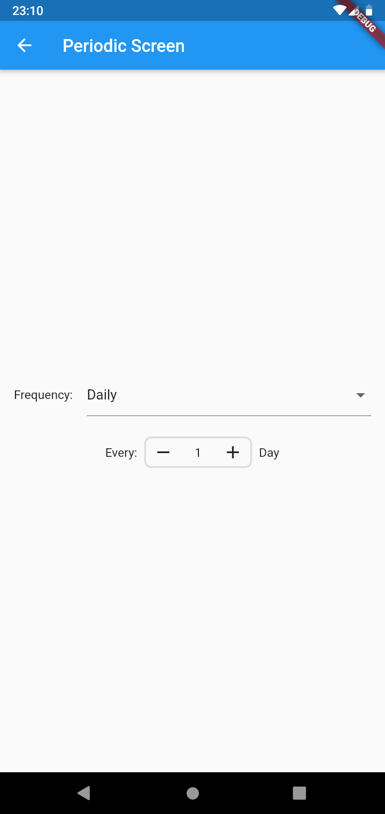
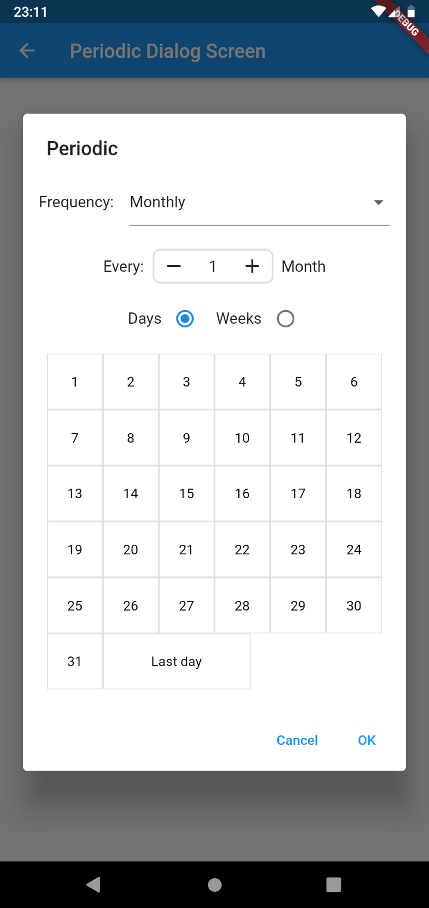

# periodic
A periodic widget (and dialog) to choose a recurring pattern.

[](https://pub.dev/packages/periodic)
[](https://www.repostatus.org/#active)
[](https://opensource.org/licenses/MIT)
[](https://github.com/pblinux/periodic)




## Getting Started

Add the dependency:
```yaml
dependencies:
  flutter:
    sdk: flutter
  periodic: 1.0.0
```

## Periodic Widget
Create a new periodic widget:
```dart
@override
Widget build(BuildContext context) {
  return Periodic();
}
```
To get result, you must pass a `PeriodicController` to the widget.

```dart
final _controller = PeriodicController()
...

Widget build(BuildContext context) {
  return Periodic(
    controller: _controller,
  );
}
...

print(_controller.current);
```

#### Configuration

You can pass a `PeriodicConfig` to the widget to modify how it looks.

```dart
Widget build(BuildContext context) {
  return Periodic(
    config: PeriodicConfig(
      frequencyMenuColor: Colors.blue,
      weekConfig: PeriodicItemConfig(
        selectedColor: Colors.blue,
        unselectedColor: Colors.white
      )
    ),
  );
}
```

## Periodic dialog

A custom dialog that has a Periodic widget as content.

```dart
showPeriodicDialog(context)
```

As any other Dialog, returns a Future with a `PeriodicData`.

```dart
final data = showPeriodicDialog(context);
print(data); // PeriodicData
```